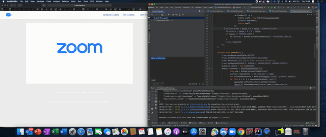

## Hazelcast Jet + Spring BOOT + Event Processing (Micro-Service) = Low Cost With High Performance Event Processing
This blog aims to explore, Hazelcast JET. Hazelcast Jet is a distributed data processing engine. This engine treats “data as streams”. Further, this engine, can process data that is stored in “database” or “files” as well as data that is streamed by Kafka

This engine is capable of performing aggregate functions over infinite data streams by dividing the streams into subsets and applying aggregation over each subset, termed as “windowing”

Jet can be deployed in a cluster of machines and then submit data processing jobs to it. Jet will make all the members of the cluster automatically process the data. Each member of the cluster consumes part of the data, and that makes it easy to scale up to really high level of throughput. 

Following are the typical usecases for Hazelcast Jet:
1.	Real-Time stream Processing
2.	Fast Batch Processing
3.	Processing Java 8 Streams in a distributed way
4.	Data processing in Microservices

This is self-contained project. Once the project has been successfully started, the swagger UI can be accessed using below url:
### Hazelcast job as service
Following example, shows the REST approach towards Hazelcast job as service.
```bash
http://localhost:8080/swagger-ui/index.html
```

 

Hazelcast jet is a distributed computing platform for fast processing of bit data sets. Jet is based on a parallel core engine allowing data-intensive applications to operate at near real-time speeds. It provides:
- Performance - low-latency at scale
- Highly optimized reading from and writing to IMDG
- Embeddable and light-weight
- Very small deployment foot prints
- Cloud native
- Distributed in-memory computation
- Data processing micro-services paradigm
- Spark Vs Jet
 
- Supports for events arriving out of order via watermarks
- Sliding, Tumbling & Session window support
- Job state and lifecycle save to IMDG IMaps and benefit from their performance, resilience, scale and persistence
- Automatic re-execution of part of the job in the event of a failed worker
- Tolerant of loss nodes, missing work will be recovered from last snapshot and re-executed
- Cluster can be scaled without interrupting jobs - new jobs benefits from the increased capacity
- State & snapshots can be persistent tor esume after cluster restart
- Processing semantics 
 
- Possibilities
 
- Pipeline APIs
   - General purpose, declarative API
   - Support fork,join,cogroup,map,filter,flatmap,reduce,groupby
   - source/sink programming model
   - DSL which through planner and converted to DAG plan for execution
   ```bash
   Start executing job '051c-b771-6680-0001', execution 051c-b771-6681-0001, execution graph in DOT format:
  digraph DAG {
  	"trade-source" [localParallelism=1];
  	"map-stateful-keyed" [localParallelism=16];
  	"mapSink(volume-by-stock)" [localParallelism=1];
  	"trade-source" -> "map-stateful-keyed" [label="distributed-partitioned", queueSize=1024];
  	"map-stateful-keyed" -> "mapSink(volume-by-stock)" [label="partitioned", queueSize=1024];
  }
  ```
   - Batch & streaming
- Adds distributed support for the java.util.stream API for Hazelcast Map, List and Cache
  - supports operations such as map(), flatmap(), filter(), reduce(), collect(), sorted(), distrinct()
  - lambda serialization is solved by creating Serializable verions of interface
  - java streams are converted to Processor API (DAG) for execution
- Custom processors
  - unified API for sinks, sources and intermediate steps
  - not required to be thread safe
  - each processor has an Inbox and Outbox per inbound and outbound edge
  - two main methods to implement
    - boolean tryProcess (int ordinal,Object item)
      - process incoming item and emit new items by populating the outbox
    - boolean complete()
       - called after all upstream processor are also completed. Typically used for sources and batch operations such as group by and distict
    - no-coperative processors may block indefintely
    - coperative processor must respect Outbox when emitting and yield it OUtbox is already full
  
 ## Live Event Processing Using Hazelcast JET
 The project shows two scenarios:
 - Sliding Window
 - Aggregation
 
 Run EventVolumeUI to see things in action:
 
  
 
 ## Live events processing
  
 
 **NOTE** The outcome can also be visualized using [Viz.js](http://viz-js.com)