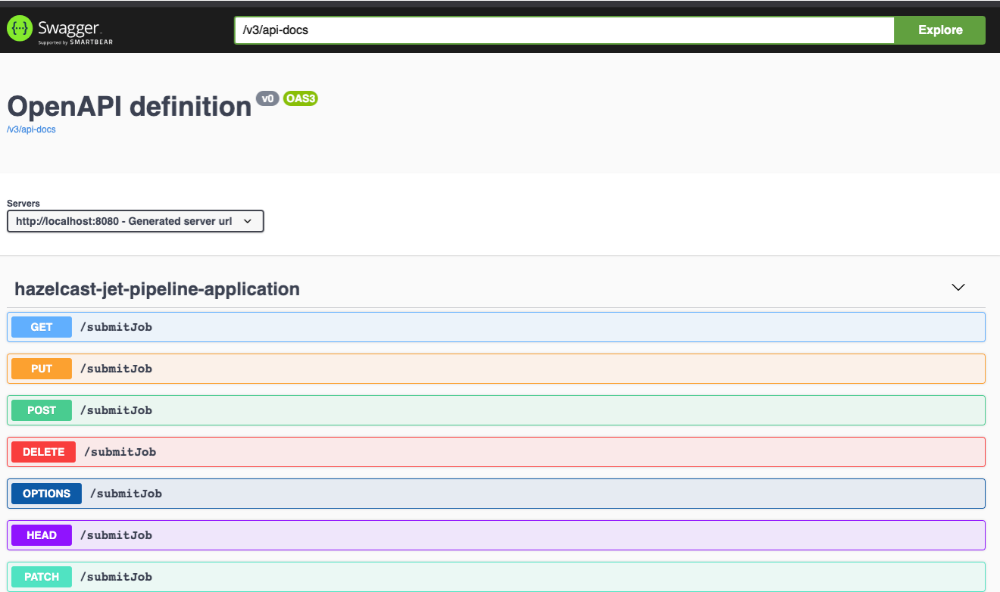
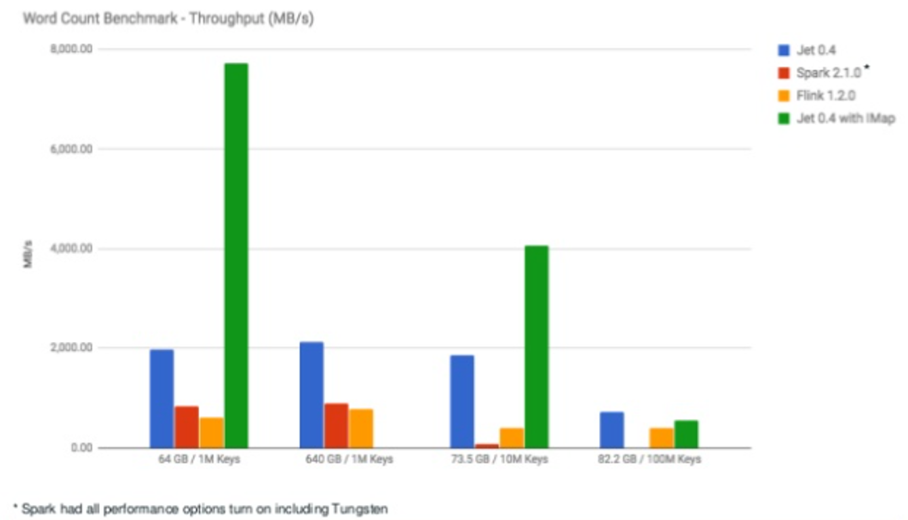
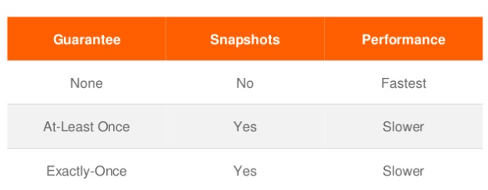
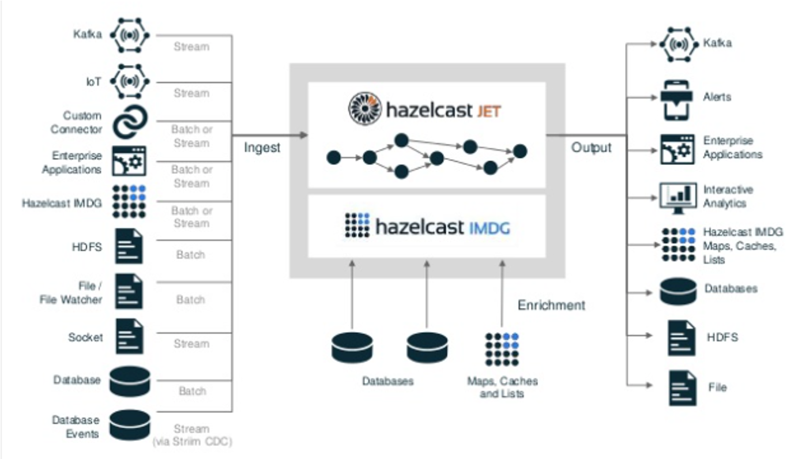

## Hazelcast Jet + Spring BOOT

Spring BOOT + Hazelcast Jet based streaming pipeline example. This is self-contained project. Once the project has been successfully started, the swagger UI can be accessed using below url:

```bash
http://localhost:8080/swagger-ui/index.html
```
 

Hazelcast jet is a distributed computing platform for fast processing of bit data sets. Jet is based on a parallel core engine allowing data-intensive applications to operate at near real-time speeds. It provides:
- Performance - low-latency at scale
- Highly optimized reading from and writing to IMDG
- Embeddable and light-weight
- Very small deployment foot prints
- Cloud native
- Distributed in-memory computation
- Data processing micro-services pardigm
- Spark Vs Jet
 
- Supports for events arriving out of order via watermarks
- Sliding, Tumbling & Session window support
- Job state and lifecycle save to IMDG IMaps and benefit from their performance, resilience, scale and persistence
- Automatic re-execution of part of the job in the event of a failed worker
- Tolerant of loss nodes, missing work will be recovered from last snapshot and re-executed
- Cluster can be scaled without interrupting jobs - new jobs benefits from the increased capacity
- State & snapshots can be persistent tor esume after cluster restart
- Processing semantics 
 
- Possibilities
 
- Pipeline APIs
   - General purpose, declarative API
   - Support fork,join,cogroup,map,filter,flatmap,reduce,groupby
   - source/sink programming model
   - DSL which through planner and converted to DAG plan for execution
   - Batch & streaming
- Adds distributed support for the java.util.stream API for Hazelcast Map, List and Cache
  - supports operations such as map(), flatmap(), filter(), reduce(), collect(), sorted(), distrinct()
  - lambda serialization is solved by creating Serializable verions of interface
  - java streams are converted to Processor API (DAG) for execution
- Custom processors
  - unified API for sinks, sources and intermediate steps
  - not required to be thread safe
  - each processor has an Inbox and Outbox per inbound and outbound edge
  - two main methods to implement
    - boolean tryProcess (int ordinal,Object item)
      - process incoming item and emit new items by populating the outbox
    - boolean complete()
       - called after all upstream processor are also completed. Typically used for sources and batch operations such as group by and distict
    - no-coperative processors may block indefintely
    - coperative processor must respect Outbox when emitting and yield it OUtbox is already full
    
 ## Live Event Processing Using Hazelcast JET
 The project shows two scenarios:
 - Sliding Window
 - Aggregation
 
 Run EventVolumeUI to see things in action:
 
  